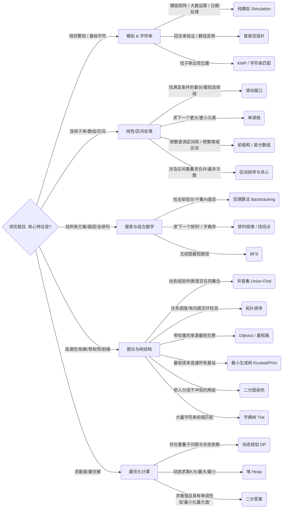

---
tags:
  - type/lit
  - topic/learning
  - status/archive
source: 《卡片盒笔记法》 by Sönke Ahrens
---

## Text

```mermaid
flowchart LR
    Start{读完题目, 核心特征是?}
    
    %% 1. 模拟与基础字符串
    Start -->|规则繁琐 / 基础字符| A[模拟 & 字符串]
    A -->|螺旋矩阵 / 大数运算 / 日期处理| A1(纯模拟 Simulation)
    A -->|回文串验证 / 数组反转| A2(首尾双指针)
    A -->|找子串出现位置| A3(KMP / 字符串匹配)
    
    %% 2. 连续/区间
    Start -->|连续子串/数组/区间| B[线性/区间处理]
    B -->|找满足条件的最长/最短连续段| B1(滑动窗口)
    B -->|求下一个更大/更小元素| B2(单调栈)
    B -->|频繁查询区间和 / 频繁增减区间| B3(前缀和 / 差分数组)
    B -->|涉及区间重叠求合并/最多次数| B4(区间排序与贪心)
    
    %% 3. 组合/路径
    Start -->|找所有方案/路径/全排列| C[搜索与组合数学]
    C -->|找全部组合/子集/N皇后| C1(回溯算法 Backtracking)
    C -->|求'下一个排列' / 字典序| C2(排列规律 / 找拐点)
    C -->|无权图最短路径| C3(BFS)
    
    %% 4. 关系/图
    Start -->|连通性/依赖/带权网/前缀| D[图论与树结构]
    D -->|动态组团/判断是否在同集合| D1(并查集 Union-Find)
    D -->|任务调度/有向图无环检测| D2(拓扑排序)
    D -->|带权重的单源最短花费| D3(Dijkstra / 最短路)
    D -->|最低成本连通所有基站| D4(最小生成树 Kruskal/Prim)
    D -->|把人分成不冲突的两组| D5(二分图染色)
    D -->|大量字符串前缀匹配| D6(字典树 Trie)
    
    %% 5. 最优化/最值
    Start -->|求最值/最优解| E[最优化计算]
    E -->|存在重叠子问题与状态依赖| E1(动态规划 DP)
    E -->|动态求第K大/最大/最小| E2(堆 Heap)
    E -->|求极值且具有单调性 \n 如'最小化最大值'| E3(二分答案)
```

---

## Thoughts
[[数量级判断]]